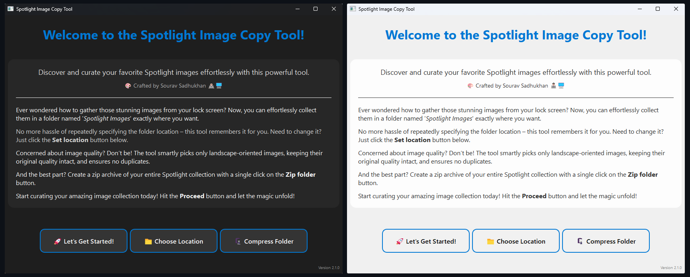

# Spotlight Image Copy Tool



The Spotlight Image Copy Tool is a user-friendly Windows application that simplifies the process of managing and organizing Windows Spotlight images. With this tool, you can effortlessly collect, convert, and organize lock screen images to build your curated collection right on your desktop.

## Description

Unlock the charm of Windows Spotlight image collections effortlessly with the Spotlight Image Copy Tool. This tool offers an intuitive interface that simplifies the process of gathering, organizing, and preserving captivating lock screen images.

**Created by**: Sourav Sadhukhan

## Features

- **Effortless Collection**: Gather captivating Windows Spotlight images with a single click.

- **Organized Storage**: Create a curated collection in a folder named 'Spotlight Images' wherever you desire.

- **Streamlined Management**: Forget about repeatedly specifying the folder location – the tool remembers your chosen destination. Modify it anytime with the 'Set location' button.

- **Quality Assurance**: The tool thoughtfully selects landscape-oriented images, preserving their original dimensions and ensuring optimal image quality.

- **Duplicate Management**: No worries about duplicate storage – the tool automatically removes duplicate images to keep your collection tidy.

- **Zip Archive Creation**: Effortlessly create a zip archive of your entire Spotlight image collection with a single click of the 'Zip folder' button.

- **Enchanting Collection**: Curate a delightful collection of images, flawlessly organized and primed for your enjoyment.

## Usage

1. Clone or download this repository to your computer.
2. Install the required Python libraries by running:

```bash
pip install -r requirements.txt
```
3. Open a terminal or command prompt in the repository folder.
4. Run the following command to execute the application:

```bash
python spotlight_ui.py
```

5. Follow the on-screen instructions to manage your Windows Spotlight images.

## Building Executable (Windows)

To create a standalone executable file for your convenience, you can use `pyinstaller`. Here's how:

1. Open a terminal or command prompt in the repository folder.
2. Run the following command to install `pyinstaller` if you haven't already:

```bash
pip install pyinstaller
```

3. Run the following command to build the executable:

```bash
pyinstaller --onefile --icon=icon_cam.png --add-data "spotlight_logic.py;spotlight_zipping_logics.py;potlight_styles.py;." spotlight_ui.py
```

4. After the process is complete, you'll find the `.exe` file in the `dist` folder.

## Running the Application

To run the application using Python directly, use the following command:

```bash
python spotlight_ui.py
```

## Notes

- The application may require administrative privileges to access system directories.
- Make sure to respect copyright and usage rights of the images you manage.

For more information and support, please contact Sourav Sadhukhan at [ssadhukhan990@gmail.com](mailto:ssadhukhan990@gmail.com).